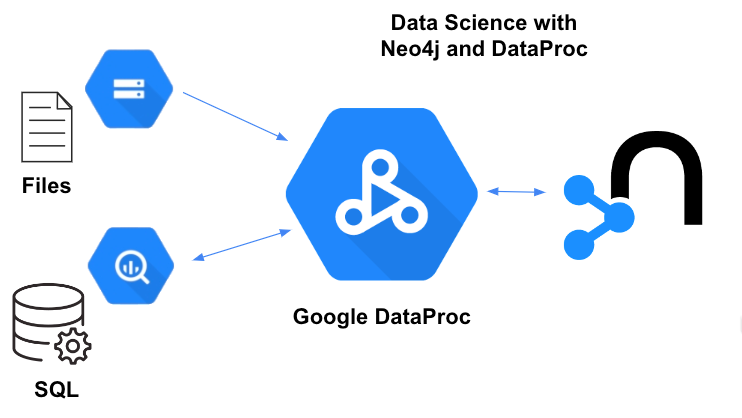
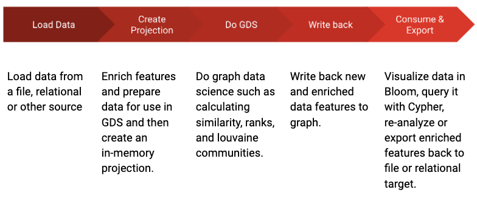
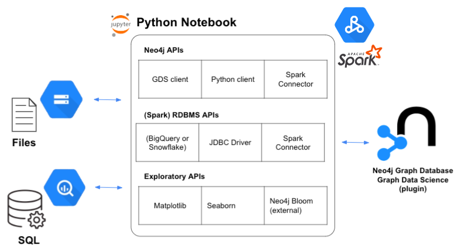

# Neo4j Python Examples



In these examples we show how to load data from text and relational sources, run graph data science algorithms on in-memory projections, write enriched features back to the database and then export them to BigQuery.

As with most data science journeys, this scenario is iterative and interactive.  We normalize the data with log functions, calculate similarity using K-Nearest neighbors and Euclidean distance, derive Louvain communities, and explore the data both in Neo4j Bloom and in our notebooks using Seaborn.

However, many exploratory scenarios prove so useful that they are operationalized in production workflows as a "graph-assisted feature engineering" step.  Value-added features make everything downstream smarter: real-time queries, visualizations, or AI/ML pipelines including VertexAI.

The python-based examples in this repository exercise the Neo4j python client, Graph Data Science (GDS) client and Spark Connector and are free for your download and adaptation.

## Analytic Flow
Rather than starting from scratch, these examples boot-strap a project developed by Nathan Smith in 2021 called [Create a similarity graph from node properties with Neo4j](https://medium.com/towards-data-science/create-a-similarity-graph-from-node-properties-with-neo4j-2d26bb9d829e).

Nathan’s article on similarity tackles the following problem.  In advertising and other fields, it is common to think of geographies as “[metropolitan statistical areas](https://en.wikipedia.org/wiki/Metropolitan_statistical_area)” (MSAs) known by close economic ties throughout the area.  A dataset of MSAs will contain rollups of socio, economic, or other characteristics that characterize the area.  Nathan tries to answer the question which MSAs are similar and to extract most similar clusters from this dataset using Neo4j.   Similar questions could be asked of asset funds, medical treatments, molecules, voters… most anything.

Likewise, the analytic approach Nathan takes would be familiar to data scientists using Neo4j as shown in the flow chart below.



The purpose of this article is not to retell Nathan’s blog but to make it easier for you to adapt his work to your own graph data projects, whether they use Spark or not.  The subset of data used for this analysis has been [added to this repository](data/census_demographics_by_metro_area.csv).

## Python Notebooks
Neo4j makes it easier for data scientists to work with graphs through a variety of [client APIs](https://neo4j.com/developer/language-guides) which wrap the binary bolt protocol.  In these examples, we utilize the Neo4j Python API, Graph Data Science (GDS) api, and the Neo4j Spark Connector which offers higher-level constructs for reading and writing Spark data.

These examples emphasize graph data science transformations which are iterative and don’t lend themselves to straight data pipelines.  For this reason it does not consider the forthcoming Apache Beam/DataFlow FlexTemplate or the Neo4j Data Warehouse (DWH) Connector, a metadata driven end-to-end pipeline that supports Google BigQuery as well as other databases.

Each notebook in this collection has been tested on Spark 2.12 in Google DataProc.  Updating library versions will allow these examples to run in other environments.  Other notebooks including [Collab](https://research.google.com/colaboratory/) (a free, exploratory oriented tool) and [Vertex AI Workbench](https://cloud.google.com/vertex-ai-workbench) will work as well.



The first <a href="1.1. Similarity Example, Graph Data Science Client - Python.ipynb">notebook</a> follows the original article’s methodology to read data from Google Cloud Storage using cypher ``LOAD_CSV`` and execute the entire flow using the elegant Graph Data Sciences (GDS) python client.  This implementation needs only Python3 (local is fine) and runs in a single thread.  An alternative implementation uses the classic <a href="1.2. Similarity Example, Python Client - Python.ipynb">Neo4j python client</a> for Neo4j.   The third and final <a href="1.3. Similarity Example, BigQuery Storage & Spark Connector & GDS Client - Python.ipynb">implementation</a> requires Spark and use Spark Connector libraries for Neo4j and BigQuery.  This notebook modifies the standard flow by reading source data from BigQuery where it also writes back graph features. 

## Pandas and DataFrames
At the outset, let’s provide some orientation about tabular data structures in the modern data science stack.  Traditional python programs execute on a single machine and all result-sets must fit in memory unless they are streamed to a collection of files, message broker, database, or other store.  The standard way to pass rowsets from one module to another is via an in-memory table called a Panda, or confusingly, Pandas DataFrame.  Common visualization libraries such as Seaborn, consume pandas and the Neo4j GDS and Python (with coercion) client libraries, return them.

Spark, however, is a distributed, parallel processing computing platform.  Jobs can be executed on a single machine by specifying ``partition=1``, but parallelized data processing requires a distributed dataset which is called simply a (Spark) DataFrame, which is immutable.   If a (Spark) DataFrame can fit into memory on one node, it can be converted to a Panda.  The reverse is always true.  The Neo4j Spark Connector returns (Spark) DataFrames from queries.

## Comparing APIs
The examples exercise several pythonic APIs.  Which one should you use?  As shown in the truth table below, the GDS client is the obvious choice for GDS projects that don’t use Spark.  


The GDS client API allows executing GDS function calls natively as well as any Cypher statement using ``run_cypher``.  Calling GDS natively function uses slightly different object syntax than writing out Cypher strings using the gds client.

When working distributed data on Spark cluster, the Neo4j Spark Connector provides read and write support like other Spark Connectors.  Although the Spark Connector supports GDS calls using the Cypher ``CALL`` syntax, the best practice is to instantiate the GDS or python client as well to handle script calls more elegantly.

## Using the GDS client
The GDS api is Neo4j's newest, most elegant and compact python API.  Usage requires importing a single library and instantiating an object on one line.

```
    from graphdatascience import GraphDataScience

    neo4j_url = "bolt://<server>:7687"
    neo4j_user = "<user>"
    neo4j_password = "<password>"

    gds = GraphDataScience(neo4j_url, auth=(neo4j_user, neo4j_password))
```

Thereafter, executing Cypher statements of any kind simply requires calling:

```
    gds.run_cypher('<Cypher statement>')
```

For GDS functions, invocation is fluent such as:

```
    g_msa, result = gds.graph.project(
        'msa-graph',
        'MSA',
        '*',
        nodeProperties = [
            "logPopulation",
            "logMedianHouseholdIncome",
            "logMedianHomePrice",
            "logPercentOver25WithBachelors"])
```

In this case, `g_msa` is a handle to the in-memory projection.

Writing data back from the in-memory graph is simple:

```
    gds.graph.writeRelationship(
        g_msa,
        "IS_SIMILAR",
        relationship_property="similarity"
    )
```

Return data structures from the GDS client are well documented.

## Spark Connector client
On DataProc in the current release, global variables applied in `SparkSession.builder` such as `neo4j.url` do not stick between method invocations.

To read records (in parallel) from Neo4j into a Spark DataFrame, execute a command like this:

```
    (neo4jDf=spark.read.format("org.neo4j.spark.DataSource")
        .option("labels", "MSA")
        .option("url", neo4j_url)  
        .option("authentication.type", "basic")
        .option("authentication.basic.username", neo4j_user)
        .option("authentication.basic.password", neo4j_password)
        .load())
```

Writing records (single threaded) to Neo4j from a Spark DataFrame can be executed like this:

```
    (castBigqueryDf.write
        .format("org.neo4j.spark.DataSource")
        .mode("Overwrite")
        .option("labels", ":MSA")
        .option("node.keys","name")
        .option("url", neo4j_url)
        .option("authentication.type", "basic")
        .option("authentication.basic.username", neo4j_user)
        .option("authentication.basic.password", neo4j_password)
        .option("partitions", "1")
        .save())
```

To avoid duplicating records, specify a key field in `node.keys`.  Although the Spark connector will run raw Cypher using the `query` option, it is itself a Cypher generator with a rich set of read and write option arguments that can generate Cypher for you.

Also, the Spark Connector specification concerns itself with reads and writes.  Nonetheless, data definition (DDL) and data modeling (DML) commands are quite frequent in an analytic workflow.  How should they be handled?  It is recommended that you add a second library, like the Python or GDS client, to execute these commands as shown in the BigQuery example.

## Parallelism
In the helper class we can manually set parallelism using the `partitions` option in the Neo4j Spark Connector.  I prefer to single-thread writes (1) and letting the system automatically configure read parallelism.  In fact, node writes can be highly parallelized.  Relationship writes could deadlock if many relationships per node are updated at once.

We know that Spark can collect results executed on many processes in parallel.  So how does Spark parallelize this query:

```
    MATCH (p:Person) RETURN p
```

In fact, the Spark Connector parses and rewrites the query.  It first figures out how many rows your query will return (let’s say 100) and then rewrites the query so it can be sharded, this way:

```
    MATCH (p:Person) RETURN p SKIP 0 LIMIT 20
    MATCH (p:Person) RETURN p SKIP 20 LIMIT 20
    MATCH (p:Person) RETURN p SKIP 40 LIMIT 20
    MATCH (p:Person) RETURN p SKIP 60 LIMIT 20
    MATCH (p:Person) RETURN p SKIP 80 LIMIT 20
```

And this is why you’ll have a hard time using SKIP and LIMIT in your Cypher queries, when running under the Spark Connector!

## Reading from and Writing to a Database
In the original blog, Nathan loads data using a [`LOAD CSV`](https://neo4j.com/docs/cypher-manual/current/clauses/load-csv/) Cypher statement which elegantly handles downloading CSV text files from a cloud source, batch loading, and flexible casting through a Neo4j unwind statement.

In many cases, the system of record will be an RDBMS like BigQuery.  When using either of these databases, their respective Spark Connector and JDBC libraries must be loaded into the Spark session.

At the time of writing, DataProc supported Spark 2.4 and the following packages are required for BigQuery.

```
    .config('spark.jars.packages',
    "org.neo4j:neo4j-connector-apache-spark_2.12:4.1.3_for_spark_2.4,
    com.google.cloud.spark:spark-bigquery-with-dependencies_2.12:0.26.0")
```

Now that the Spark session is initialized with the right libraries (the full initializer is in the code), we can read and write to our databases.

## Data Types
When importing data from a relational database, pay attention to data types.  

For example, some databases do not support float data types so it is necessary to downcast all decimals and doubles to floats, after querying.

You can inspect data types with the `df.printSchema()` method.

There are many possible ways to recast columns in a DataFrame; here `selectExpr` is shown:

```
    floatCastSelectExpr=["NAME as name","cast(POPULATION as long) population",\
    "cast(PERCENTOVER25WITHBACHELORS as float) percentOver25WithBachelors",\
    "cast(MEDIANHOMEPRICE as int) medianHomePrice",\
    "cast(MEDIANHOUSEHOLDINCOME as int) medianHouseholdIncome"]

    castedDf = rawDf.selectExpr(floatCastSelectExpr)
```

After down-casting doubles and decimals which Neo4j does not support, to floats or integers which it does, populating Neo4j nodes from a Spark DataFrame is trivial, and identical regardless of source.

```
    (castedDf.write
    .format("org.neo4j.spark.DataSource")
    .mode("ErrorIfExists")
    .option("labels", ":MSA")
    .option("url", neo4j_url)
    .option("authentication.type", "basic")
    .option("authentication.basic.username", neo4j_user)
    .option("authentication.basic.password", neo4j_password)
    .option("partitions", "1")
    .save())
```

BigQuery fully supports Neo4j datatypes but casting may be necessary if the native types are mismatched.  

## Big Query
Also, BigQuery users know that plain SQL queries require `viewsEnabled` and `materializationDataset` options to be set.  

Every time a query is executed, intermediary results will be cached in a temporary table in the schema (BigQuery calls it a “dataset”).

That table will be reaped after 1 day by default, more frequently if overridden.

```
    spark.conf.set("viewsEnabled","true")
    spark.conf.set("materializationDataset","census")
    # if this value is too low, big query will expect that it exists in cache.  Default is 1440.
    spark.conf.set("materializationExpirationTimeInMinutes",5)
    
    msa_query="""
        SELECT name
        ,population
        ,percentOver25WithBachelors
        ,medianHomePrice
        ,medianHouseholdIncome
        FROM `neo4jbusinessdev.census.msa_demos`
    """
    bigqueryDf = spark.read.format("bigquery").option("query",msa_query).load()
```

However, materialization is not necessary when using the table (vs query) option because a BigQuery likes to keep around result caches but a table (SELECT * FROM <table>) doesn’t need a copy of itself!  For example:

```
    msa_table="""
        neo4jbusinessdev.census.msa_demos
    """
    tableBqDf = spark.read.format("bigquery").option("table",msa_table).load()
```

Should derivative DataFrames then be required, secondary filtering can be done using Spark SQL as shown:

```
    tableBqDf.createOrReplaceTempView("msa_df")
    bigqueryPostQueryDf = spark.sql("SELECT * FROM msa_df WHERE population > 1000")
```

After enriching features in a graph, it may be desirable to write them back to a relational source for use downstream in an AI/ML pipeline, or with business intelligence clients like Tableau, Looker, or PowerBI.

With BigQuery, a temporary Google Cloud Storage (GCS) bucket is required.  Otherwise, everything is straight-forward in the Spark DataFrame way.

```
# tmp_working_bucket
spark.conf.set("temporaryGcsBucket", "neo4j_sandbox")

(relsDf.write.format("bigquery")
  .mode("overwrite") 
  .option("table","neo4jbusinessdev.census.msa_demo_similarity")
  .save())
```

## Why it matters
Nathan says that he became a graph evangelist when he realized how much code could be avoided by persisting and querying data in Neo4j rather than re-hydrating intermediate results over and over again and using custom algorithms to analyze it.  Collaborating on a shared database is valuable.  Deleting in-memory projections is as easy as creating them.  It is easy to source data from files or relational databases, and to write back enriched features to original sources or to other targets.  Exporting graph embeddings to AI/ML systems is just another graph data science function (not shown here).

Increasing demands on data scientists require higher productivity tools.  Most data scientists are still rolling their own algorithms or using “[free code](https://wiki.python.org/moin/PythonGraphLibraries)” for the job.  Others have already discovered that adding Neo4j to their python data science tool-belt offers these benefits:

<li>Persisting data across runs</li>
<li>Easy querying of graph structures using Cypher query language</li>
<li>Executing more complex algorithms faster thanks to constant-time O(1) query behavior</li>
<li>Participating in a community of over 200,000 graph experts</li>
<li>Sharing graph datasets between processes and team members</li>
<li>Running more than 60+ graph data science algorithms and ML  in memory</li>
<li>Exporting graph embeddings to AI/ML systems</li>

In these three notebook examples we implement the analytic workflow described in Nathan Smith’s wonderful article Create a similarity graph from node properties with Neo4j.

Please leverage the examples here to get more done faster using Neo4j and a variety of pythonic APIs, with or without Spark.  The approaches described here work with most modern versions of Apache Spark >= 2.4.5, and also work with Spark 3. We suggest you try Google Dataproc.

We’ve already seen customers build machine learning pipelines, data science workflows, and applications using Neo4j Aura and Apache Spark, and we can’t wait to see what you will build next!

## Getting Started
The best place to find out more about this release is via the official documentation.  You can also drop by the Neo4j Community site to ask questions, or get in touch directly with your Neo4j representative.
For application development, if you aren’t already an Aura user, you can [sign up for AuraDB](https://neo4j.com/cloud/platform/aura-graph-database) to get started right away.  For data science, sign up for [AuraDS](https://neo4j.com/cloud/platform/aura-graph-data-science) hosted on the Google Cloud. To roll your own Neo4j cluster on the Google Cloud, check out the incrementally billed [marketplace listing](https://neo4j.com/cloud/aura-google-cloud/).

## Github merge notes
```
git remote add upstream https://github.com/GoogleCloudDataproc/cloud-dataproc
git fetch upstream master
git rebase upstream/master
```
## Maintainer

    Anthony Krinsky 
    Sr. Sales Engineer
    anthony.krinsky@neo4j.com
