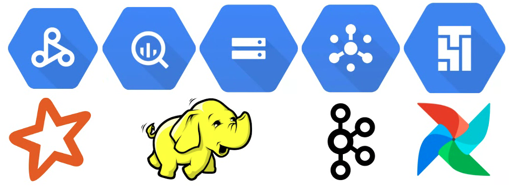

# Dataproc - Spark Scala Quickstart

**Dataproc - Spark Scala Quickstart** is an effort to assist in the creation of Spark jobs written in Scala to run on [Dataproc](https://cloud.google.com/dataproc). Google is providing different pre-implemented Spark jobs and technical guides to run them on GCP.  
 
This guide is based on the WordCount ETL example with common sources and sinks (Kafka, GCS, BigQuery, etc).  
It is intended to catalyze your development to run Spark jobs written in Scala on Dataproc.  

It is demonstrated how to run Spark jobs using Dataproc Submit, Serverless, Workflow and how to orchestrate them with [Cloud Composer](https://cloud.google.com/composer).

If you are looking to use Dataproc Templates, please refer to this [repository](https://github.com/GoogleCloudPlatform/dataproc-templates).  
Also, check out the [quickstart documentation](https://cloud.google.com/dataproc/docs/quickstarts) for other quickstarts.



Recommended versions
```
Scala = 2.12.14
Spark = 3.1.2
sbt = 1.6.1
Python = 3.8.12
Airflow = 2.2.3
Composer = composer-2.0.6-airflow-2.2.3
Dataproc = 2.0-debian10
```

Note: if using Dataproc Serverless (detailed in the guides as one of the options to run jobs), please recompile the jobs using Spark version 3.2.0

### Before you start

- Be aware that the data format used in this guide for data in GCS is [Parquet](https://parquet.apache.org/).
- Follow the [setup instructions](./_docs/setup.md) for installing, testing and compiling the project.
- This guide is configured to run the main class, despite Dataproc having the option to specify another class to run.

[](https://console.cloud.google.com/cloudshell/editor)

<hr/>

## Dataproc Spark Use Cases

0) [Create Mock Dataset](_docs/dataproc/0_create-dataset.md)
    - Creates input and output mock WordCount datasets in GCS and BQ to use in other examples  
1) [Streaming - Kafka to GCS](_docs/dataproc/1_streaming-kafka-gcs.md)
    - Runs a Spark Structured Streaming WordCount example from Kafka to GCS  
2) [Batch - GCS to GCS](_docs/dataproc/2_batch-gcs-gcs.md)
    - Runs a Spark WordCount example from GCS to GCS  
       - Appendix: Load from GCS to BQ
       - Appendix: Create BQ External table pointing to GCS data  
3) [Batch - GCS to BQ](_docs/dataproc/3_batch-gcs-bq.md)
    - Runs a Spark WordCount example from GCS to BQ  

### Orquestrate with Cloud Composer

This part of the guide provides example DAGs to run on [Cloud Composer](https://cloud.google.com/composer) to orquestrate the jobs from section above.

A) [Batch - Dataproc Submit - Creating and Deleting Cluster](_docs/composer/A_batch-submit-cluster.md)  
B) [Batch - Dataproc Workflow](_docs/composer/B_batch-workflow.md)    
C) [Batch - Dataproc Serverless](_docs/composer/C_batch-serverless.md)    
D) [Load from GCS to BQ](_docs/composer/D_batch-bq-import.md)  

<hr/>

### Backlog

- Streaming - Kafka to BigQuery
- Streaming - PubSub Lite to GCS
- Streaming - PubSub Lite to BigQuery
- Batch - BigQuery to BigQuery

### References

#### GCP Resources

- [Spark to Dataproc](https://cloud.google.com/architecture/hadoop/migrating-apache-spark-jobs-to-cloud-dataproc)
- [BigQuery Write API](https://cloud.google.com/bigquery/docs/write-api)
- [BigQuery External Tables](https://cloud.google.com/bigquery/docs/external-tables)
- [Dataproc Serverless](https://cloud.google.com/dataproc-serverless/docs/overview)
- [Dataproc Workflows](https://cloud.google.com/dataproc/docs/concepts/workflows/using-yamls)
- [Spark BigQuery Connector](https://github.com/GoogleCloudDataproc/spark-bigquery-connector)
- [Data Lake on GCS Architecture](https://cloud.google.com/architecture/build-a-data-lake-on-gcp)

#### Spark Resources

- [Spark SQL Migration Guide](https://spark.apache.org/docs/latest/sql-migration-guide.html)
- [Spark Structured Streaming](https://spark.apache.org/docs/3.1.2/structured-streaming-programming-guide.html)
- [Spark Kafka Integration](https://spark.apache.org/docs/3.1.2/structured-streaming-kafka-integration.html)

#### Composer Resources

- [Google Cloud Airflow Operators](https://airflow.apache.org/docs/apache-airflow-providers-google/stable/operators/cloud/index.html)

#### Initialisms

```
GPC = Google Cloud Plataform  
GCS = Google Cloud Storage  
BQ = BigQuery  
DAG = Direct Acyclic Graph
```