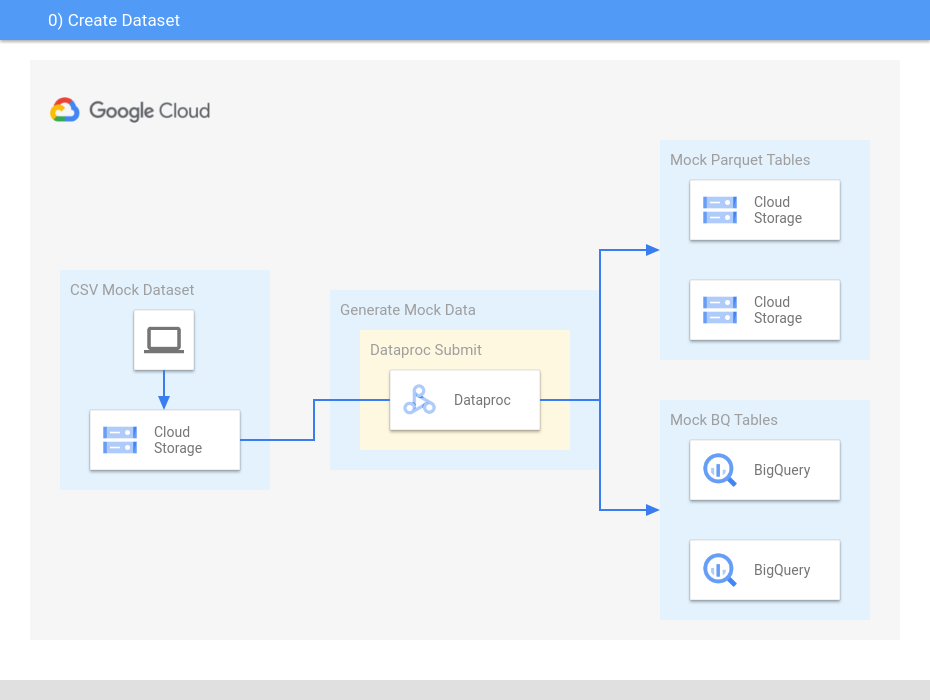

# Dataproc - Generate Dataset

#### This session guides you to generate mock data (Parquet and BQ table) of the Input and Output tables to use in other examples
The src code used in this guide is located [here](../../dataproc/create-dataset/src/).  



### Generated Input Data
```console
________________________________________________________________________________
|value				|timestamp			|date		|
|_______________________________|_______________________________|_______________|	
|Lorem ipsum dolor sit amet	|2022-01-25 02:35:55.630 UTC	|2022-01-25	|
|_______________________________|_______________________________|_______________|
partitioned by date_partition=YYYY-MM-DD (copy of date column)
```

### Generated Output Data
```console
 _______________________________________________________________
|words	|count	|timestamp			|date		|
|_______|_______|_______________________________|_______________|	
|Lorem	|1	|2022-01-25 02:36:42.630 UTC	|2022-01-25	|	
|ipsum	|1	|2022-01-25 02:36:42.630 UTC	|2022-01-25	|	
|dolor	|1	|2022-01-25 02:36:42.630 UTC	|2022-01-25	|	
|sit	|1	|2022-01-25 02:36:42.630 UTC	|2022-01-25	|	
|amet	|1	|2022-01-25 02:36:42.630 UTC	|2022-01-25	|
|_______|_______|_______________________________|_______________|
partitioned by date_partition=YYYY-MM-DD (copy of date column)
```

### Prerequisites

- Compile the jar of the application
- [Create a Dataproc cluster](https://cloud.google.com/dataproc/docs/guides/create-cluster)

### Step 1 - Setup GCP Environment Variables

```console
export PROJECT_ID="your_project_id"
export CLUSTER_ID="your_cluster_id"
export REGION="your_region"
export BUCKET="gs://your_bucket-create-dataset"
export SPARK_APP_PATH="${BUCKET}/your_spark_app.jar"
```

### Step 2 - Setup Application Variables

```console
export RAW_CSV="${BUCKET}/your_raw_data.csv"
export GENERATED_INPUT_PARQUET="${BUCKET}/your_mock_input_data_path/"
export GENERATED_OUTPUT_PARQUET="${BUCKET}/your_mock_output_data_path/"
export BQ_DATASET="your_bq_dataset"
export GENERATED_INPUT_TABLE="${BQ_DATASET}.your_mock_input_table"
export GENERATED_OUTPUT_TABLE="${BQ_DATASET}.your_mock_output_table"
export TEMPORARY_BQ_BUCKET="your_bucket/your_temp_bucket_path/"   # here the bucket is e.g. "your_bucket" and not "gs://your_bucket"
```

### Step 3 - Create bucket and BQ Dataset

```console
export BUCKET_CLASS=YOUR_CLASS          # e.g. STANDARD
gsutil mb -p ${PROJECT_ID} -c ${BUCKET_CLASS} -l ${REGION} ${BUCKET}

export BQ_LOCATION=YOUR_LOCATION        # e.g. US
bq mk --location=${BQ_LOCATION} --dataset ${BQ_DATASET}
```

### Step 4 - Copy Raw CSV Dataset and Spark jar

```console
gsutil cp src/main/resources/data.csv ${BUCKET}/your_raw_data.csv
gsutil cp target/scala-2.12/{YOUR_LOCAL_JAR}.jar $SPARK_APP_PATH
```

### Step 5 - Run using Dataproc Submit

```console
gcloud dataproc jobs submit spark \
    --cluster=$CLUSTER_ID \
    --jar=$SPARK_APP_PATH \
    --region=$REGION \
    -- --rawCsv=${RAW_CSV} \
       --inputParquet=${GENERATED_INPUT_PARQUET} \
       --outputParquet=${GENERATED_OUTPUT_PARQUET} \
       --inputTable=${GENERATED_INPUT_TABLE} \
       --outputTable=${GENERATED_OUTPUT_TABLE} \
       --temporaryGcsBucketPath=${TEMPORARY_BQ_BUCKET}
```

### Result
You can now use the following variables in other jobs if you need.
```console
echo ${GENERATED_INPUT_PARQUET}  #-- points to the generated populate Parquet files  (Input data)
echo ${GENERATED_OUTPUT_PARQUET} #-- points to the generated populate Parquet files  (Output data)
echo ${GENERATED_INPUT_TABLE}    #-- points to the generated populate BigQuery table (Input data)
echo ${GENERATED_OUTPUT_TABLE}   #-- points to the generated populate BigQuery table (Output data)
```

### Appendix: Load Parquet to BigQuery from command line

You can load the Parquet to BigQuery using following the steps below.  
This will result in a BigQuery table partitioned by date=YYYY-MM-DD instead of date_partition=YYYY-MM-DD.  
The --replace flag overwrites if table already exists.
```console
export GENERATED_DATE_PARTIONED_TABLE="your_dataset.your_mock_input_table_imported"
export SRC_PARQUET_DATA="${GENERATED_INPUT_PARQUET}*.parquet"
bq load --replace --source_format=PARQUET --time_partitioning_field="date" ${GENERATED_DATE_PARTIONED_TABLE} ${SRC_PARQUET_DATA}
```

### Code Snippets
All code snippets within this document are provided under the following terms.
```
Copyright 2022 Google. This software is provided as-is, without warranty or representation for any use or purpose. Your use of it is subject to your agreement with Google. 
```
