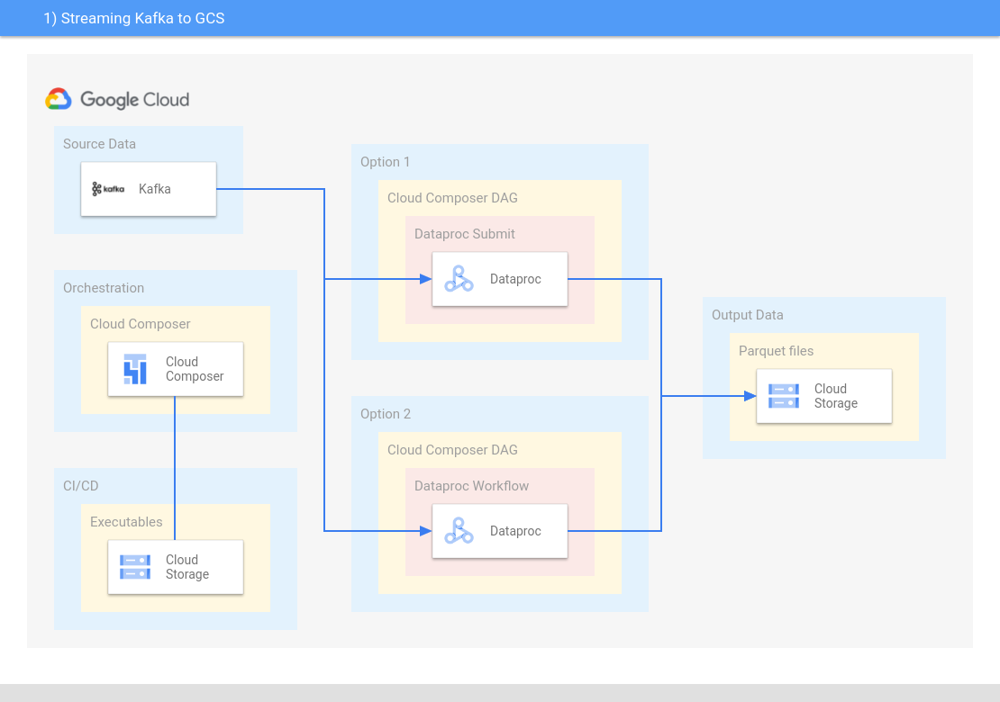

# Dataproc - Streaming Kafka to GCS

#### This session guides you to create Streaming Spark Structured Streaming Job to transform data from Kafka to Google Cloud Storage
The src code used in this guide is located [here](../../dataproc/streaming-kafka-gcs/src/).



### Input Table (Kafka Record)
```console
________________________________
|value				|
|_______________________________|	
|Lorem ipsum dolor sit amet	|
|_______________________________|
```

### Output Table
```console
 _______________________________________________________________________________________________________________________________
|window.start			|window.end			|words	|count	|timestamp			|date		|
|_______________________________|_______________________________|_______|_______|_______________________________|_______________|	
|2022-01-25 02:35:50 UTC	|2022-01-25 02:36:00 UTC 	|Lorem	|1	|2022-01-25 02:36:42.630 UTC	|2022-01-25	|	
|2022-01-25 02:35:50 UTC	|2022-01-25 02:36:00 UTC 	|ipsum	|1	|2022-01-25 02:36:42.630 UTC	|2022-01-25	|	
|2022-01-25 02:35:50 UTC	|2022-01-25 02:36:00 UTC 	|dolor	|1	|2022-01-25 02:36:42.630 UTC	|2022-01-25	|	
|2022-01-25 02:35:50 UTC	|2022-01-25 02:36:00 UTC 	|sit	|1	|2022-01-25 02:36:42.630 UTC	|2022-01-25	|	
|2022-01-25 02:35:50 UTC	|2022-01-25 02:36:00 UTC 	|amet	|1	|2022-01-25 02:36:42.630 UTC	|2022-01-25	|
|_______________________________|_______________________________|_______|_______|_______________________________|_______________|
TODO - make it partitioned
```

### Prerequisites

- Have a Kafka cluster running to connect to (dev-tools instructions below)
- Compile the jar of the application
- [Create a Dataproc cluster](https://cloud.google.com/dataproc/docs/guides/create-cluster) to run the streaming job

### Step 1 - Setup GCP Environment Variables

```console
export PROJECT_ID="your_project_id"
export CLUSTER_ID="your_cluster_id"
export REGION="your_region"
export BUCKET="gs://your_bucket-streaming-kafka-gcs"
export SPARK_APP_PATH="${BUCKET}/your_spark_app.jar"
```

### Step 2 - Setup Application Variables

```console
export KAFKA_BROKERS="your_kafka_brokers"
export TOPIC="your_kafka_topic"
export BUCKET_CHECKPOINT_PATH="${BUCKET}/your_stream_checkpoint_path/"
export WATERMARK_PERIOD="your_period (e.g. "10 seconds")"
export WINDOW_PERIOD="your_period (e.g. "10 seconds")"
export TRIGGER_PERIOD="your_period (e.g. "10 seconds")"
export BUCKET_OUTPUT_PATH="${BUCKET}/your_stream_data_output_path/"
```

### Step 3 - Create bucket

```console
export BUCKET_CLASS=YOUR_CLASS          # e.g. STANDARD
gsutil mb -p ${PROJECT_ID} -c ${BUCKET_CLASS} -l ${REGION} ${BUCKET}
```

### Step 4 - Copy Spark jar

```console
gsutil cp target/scala-2.12/{YOUR_LOCAL_JAR}.jar $SPARK_APP_PATH
```

### Step 5 - Run using Dataproc Submit

[Jobs Submit Reference Documentation](https://cloud.google.com/sdk/gcloud/reference/dataproc/jobs/submit)

```console
gcloud dataproc jobs submit spark \
    --cluster=$CLUSTER_ID \
    --jar=$SPARK_APP_PATH \
    --region=$REGION \
    -- --brokers=$KAFKA_BROKERS \
       --topic=$TOPIC \
       --checkpointPath=$BUCKET_CHECKPOINT_PATH \
       --watermark="$WATERMARK_PERIOD" \
       --windowDuration="$WINDOW_PERIOD" \
       --triggerProcTime="$TRIGGER_PERIOD" \
       --outputPath=$BUCKET_OUTPUT_PATH    
```

### Result
You now have a populated output parquet table with the following path, after processing Kafka WordCount events.
```console
echo ${BUCKET_OUTPUT_PATH}
```

### Appendix: Load Parquet to BigQuery from command line

You can load the Parquet to BigQuery using following the steps below.  
The --replace flag overwrites if table already exists.
```console
export GENERATED_DATE_PARTIONED_TABLE="your_dataset.your_stream_table_imported"
export SRC_PARQUET_DATA="${GENERATED_INPUT_PARQUET}*.parquet"
bq load --replace --source_format=PARQUET ${GENERATED_DATE_PARTIONED_TABLE} ${SRC_PARQUET_DATA}
```

### Appendix: Dev-Tools - Setup Dev GCP Kafka

If you want quickly a Kafka cluster on GCP and be able to send sentences messages to the topic, an option is:

1) Go to [GCP Marketplace](https://cloud.google.com/marketplace), and launch an **Apache Kafka Server on CentOS 8.4 Server**.
2) Go to your GCP Compute Engine VM Instances and locate the created Kafka instance.
3) Open 3 SSH sessions and apply the following commands:

```console
# SSH 1
# Start Zookeeper
cd /opt/kafka/
sudo bin/zookeeper-server-start.sh config/zookeeper.properties
```
```console
# SSH 2
# Start Kafka
cd /opt/kafka/
sudo bin/kafka-server-start.sh config/server.properties
```
```console
# SSH 3
# Create topic and open console to send messages
cd /opt/kafka/
bin/kafka-topics.sh --create --partitions 1 --replication-factor 1 --topic my-topic --bootstrap-server localhost:9092
bin/kafka-console-producer.sh --topic my-topic --bootstrap-server localhost:9092
```

Be aware of the incurred costs.

### Code Snippets
All code snippets within this document are provided under the following terms.
```
Copyright 2022 Google. This software is provided as-is, without warranty or representation for any use or purpose. Your use of it is subject to your agreement with Google. 
```
