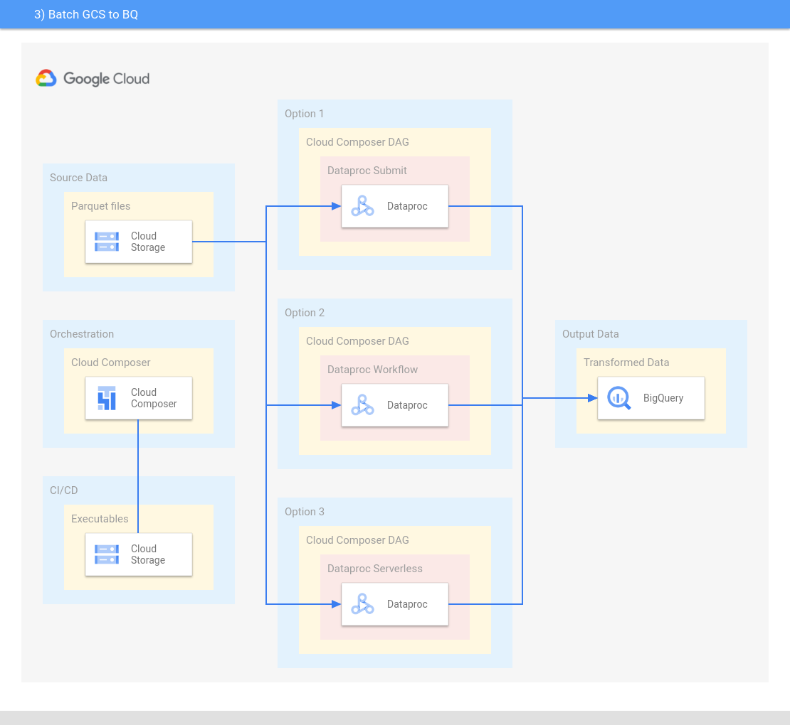

# Dataproc - Batch GCS to BQ

#### This session guides you to create a Batch Spark Job to transform data from Google Cloud Storage to BigQuery
The src code used in this guide is located [here](../../dataproc/batch-gcs-bq/src/).



### Input Table
You can generate this input table using the create-dataset job
```console
________________________________________________________________________________
|value				|timestamp			|date		|
|_______________________________|_______________________________|_______________|	
|Lorem ipsum dolor sit amet	|2022-01-25 02:35:55.630 UTC	|2022-01-25	|
|_______________________________|_______________________________|_______________|
partitioned by date_partition=YYYY-MM-DD (copy of date column)
```

### Output Table
```console
 _______________________________________________________________
|words	|count	|timestamp			|date		|
|_______|_______|_______________________________|_______________|	
|Lorem	|1	|2022-01-25 02:36:42.630 UTC	|2022-01-25	|	
|ipsum	|1	|2022-01-25 02:36:42.630 UTC	|2022-01-25	|	
|dolor	|1	|2022-01-25 02:36:42.630 UTC	|2022-01-25	|	
|sit	|1	|2022-01-25 02:36:42.630 UTC	|2022-01-25	|	
|amet	|1	|2022-01-25 02:36:42.630 UTC	|2022-01-25	|
|_______|_______|_______________________________|_______________|
partitioned by date_partition=YYYY-MM-DD (copy of date column)
```

### Prerequisites

- Compile the jar of the application

### Step 1 - Setup GCP Environment Variables

```console
export PROJECT_ID="your_project_id"
export CLUSTER_ID="your_cluster_id"
export REGION="your_region"
export BUCKET="gs://your_bucket-batch-gcs-to-bq"
export SPARK_APP_PATH="${BUCKET}/your_spark_app.jar"
export BQ_DATASET="migration_dataset"
```

### Step 2 - Setup Application Variables

```console
export BUCKET_INPUT_PATH="${BUCKET}/your_data_input_path/"
export OUTPUT_TABLE="${BQ_DATASET}.your_bq_job_output_table"
export BQ_WRITE_MODE="indirect" # use indirect in this example because partitioning and overwriting is not currently supported using direct mode
export TEMPORARY_BQ_BUCKET="your_bucket/your_temp_bucket_bq_path/"   # here the bucket is e.g. "your_bucket" and not "gs://your_bucket"
```

### Step 3 - Create bucket and BQ Dataset

```console
export BUCKET_CLASS=YOUR_CLASS          # e.g. STANDARD
gsutil mb -p ${PROJECT_ID} -c ${BUCKET_CLASS} -l ${REGION} ${BUCKET}

export BQ_LOCATION=YOUR_LOCATION        # e.g. US
bq mk --location=${BQ_LOCATION} --dataset ${BQ_DATASET}
```

### Step 4 - Copy Spark jar

```console
gsutil cp target/scala-2.12/{YOUR_LOCAL_JAR}.jar $SPARK_APP_PATH
```

### Step 5

#### Option 1) Run using Dataproc Submit

[Jobs Submit Reference Documentation](https://cloud.google.com/sdk/gcloud/reference/dataproc/jobs/submit)

Prerequisite: [Create a Dataproc cluster](https://cloud.google.com/dataproc/docs/guides/create-cluster). Note: since it is a batch job, instead of creating a persistent cluster, follow the Composer guide, to run the job using a pipeline, that creates an ephemeral cluster and then deletes it after running the job

```console
gcloud dataproc jobs submit spark \
    --cluster=$CLUSTER_ID \
    --jar=$SPARK_APP_PATH \
    --region=$REGION \
    -- --inputPath=$BUCKET_INPUT_PATH \
       --outputTable=$OUTPUT_TABLE \
       --writeMode=$BQ_WRITE_MODE \
       --temporaryGcsBucketPath=$TEMPORARY_BQ_BUCKET
          
```

#### Option 2) Run using Dataproc Workflow

[Workflow Reference Documentation 1](https://cloud.google.com/dataproc/docs/concepts/workflows/overview)  
[Workflow Reference Documentation 2](https://cloud.google.com/sdk/gcloud/reference/dataproc/workflow-templates/instantiate-from-file)  

Before running the workflow, you must update the gcp-dataproc-workflow/workflow.yaml file with the required variables values that above are passed as arguments.  
This example workflow will create an ephemeral cluster to run the job (Managed Cluster), but it can also be configured to select an existing cluster (Cluster Selector).
```console
export BUCKET_WORKFLOW_PATH="${BUCKET}/config/batch-gcs-bq-workflow.yaml"
gsutil cp gcp-dataproc-workflow/batch-gcs-bq-workflow.yaml $BUCKET_WORKFLOW_PATH      
gcloud dataproc workflow-templates instantiate-from-file \
    --file=$BUCKET_WORKFLOW_PATH \
    --region=$REGION
    --async
```

#### Option 3) Dataproc Serverless Submit

[Serverless Batches Submit Reference Documentation](https://cloud.google.com/sdk/gcloud/reference/dataproc/batches/submit)

```console
gcloud dataproc batches submit spark \
    --region=$REGION \
    --jar=$SPARK_APP_PATH \
    --subnet="your_subnet" \
    -- --inputPath=$BUCKET_INPUT_PATH \
       --outputTable=$OUTPUT_TABLE \
       --writeMode=$BQ_WRITE_MODE \
       --temporaryGcsBucketPath=$TEMPORARY_BQ_BUCKET
```

### Result
You now have a populated BigQuery table with the following path.
```console
echo ${OUTPUT_TABLE}
```

### Code Snippets
All code snippets within this document are provided under the following terms.
```
Copyright 2022 Google. This software is provided as-is, without warranty or representation for any use or purpose. Your use of it is subject to your agreement with Google. 
```
