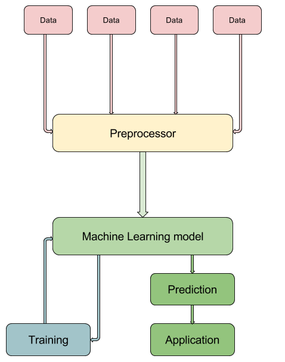

# Spark-TensorFlow interaction

This example provides a model for how Spark and TensorFlow can operate together.

- - -

## Overview

The model that we present here for the interoperation between the two frameworks
is inspired by that of [tf.Transform](https://github.com/tensorflow/transform).

Consider your standard Machine Learning workflow:

1. Data comes in from possibly a multitude of sources.
 
2. This data generally comes in dirty and requires some degree of preprocessing
before it can be put to serious use. One common example of a preprocessing
operation is the filling in of null values in the data.

3. The preprocessed data is fed into the Machine Learning model that sits at the
heart of the pipeline. Generally, this data comes in two flavors - training
data, which will be used to update the model parameters, and prediction data,
for which the output of the model will be used in some application which
built around the pipeline in question.

### Preprocessing

There is no clear criterion by which we can distinguish preprocessing operations
from the processing that takes place inside the core machine learning component
of such a workflow.

However, the Machine Learning techniques that are usually used in the solution
of practical problems tend to be fairly mature and, as such, the corresponding
models have reasonably well-defined interfaces. For example, a model that makes
use of logistic regression to classify its inputs expects to receive numerical
inputs.

Preprocessing generally involves transforming data that you have received, and
which you have no control over, into a form consistent with such an interface to
your model.

Preprocessing operations can come in two flavors:

1. Operations that can be applied to each data point locally, without reference
to global properties of the dataset. An example of such an operation is the
conversion of dates into epoch times.

2. Operations that require global properties of the dataset. An example of such
an operation is the filling in of a missing value for a numerical feature with
the mean value for that feature over points in the dataset for which the
feature is not missing.

Operations of the second type require a full pass over (a subset of) the dataset
in order to compute whatever contextual information is required. In the example
above, we would require a full pass over our training data in order to calculate
the mean value for the given feature.

Following [tf.Transform](https://github.com/tensorflow/transform), we make a
distinction between two types of preprocessing components:

1. Analyzers, which produce preprocessing artifacts from a full pass over a
dataset.

2. Transformers, which make use of any artifacts produced by Analyzers (if
necessary) to actually transform the data.

### Spark and TensorFlow

The use cases we represent here involve being loaded into Spark from various
sources. We will show how such data can be used to train TensorFlow models and
how these models can then be served on Google Cloud Platform.

As this makes it possible for the served models to be used even from outside
Spark, it is logical for us to want the preprocessing transformations to be
packaged with the TensorFlow models. The analyzer preprocessing components,
however, are much better suited to implementation in Spark.

Therefore, we will impose a demarcation between Spark and TensorFlow at the
preprocessing phase with all Analyzers being implemented with Spark and all
Transformers being implemented in TensorFlow. We will load artifacts produced
by Spark into TensorFlow to inform the Transformers.

### The Example

We will set up a pipeline for the prediction of ad clicks, making use of some of
the data released by
[Criteo Research](http://research.criteo.com/outreach/).

- - -

## Understanding the data

The Criteo Kaggle data set contains both labelled (`train.txt`) and unlabelled
(`test.txt`) data. Each of data points in this data set contains information
about an advertisement and a user to whom that advertisement was displayed. Each
line of the data files represents a single data point and consists (in order) of
the following features, separated by tabs:

1. 13 integer features, which "mostly" represent counts as per the Criteo
   description of the data set on Kaggle.

2. 26 categorical features, each of whose values has been hashed so as to strip
   them of any inferrable semantic significance.

Additionally, the data points in the `train.txt` file are prepended by their
label - 1 if the advertisement corresponding to that data point was clicked on
by the user corresponding to that data point, and 0 otherwise.

### Mapping categories to numbers

As we are planning to use a linear model to perform our classification, there is
an expectation from the model that every feature take on a numerical value. This
means that we need to adopt a policy for the conversion of the categorical
feature values into numbers. Moreover, as the relative sizes of the numbers
representing each cateogrical feature value will affect the linear
classification of our data points, we must make sure that the numerical scheme
contains some information about the categorical values they are encoding. We
will apply the following two constraints:

1. We will treat each categorical feature independently from the others. This
   means that we will have a distinct numerical embedding for the values of each
   categorical feature.

2. For a given categorical feature, for any two values, the relative sizes of
   their corresponding numerical values will reflect the relative frequencies
   with which the categorical values appear in the data set.

This suggests the following simple policy for our embeddings:
*We will assign each value of a given categorical feature its rank once the
values for that feature have been sorted (in descending order) by frequency.*

We will also reserve one out-of-value label for each feature, representing all
categories that were not encountered in training.

### Handling missing values

The next problem we need to address is that of missing values. In the
Criteo data set, there are no guarantees regarding any feature in any data
point. For any data point, any feature could have a missing value. Given the
constraints of our model in that it needs its inputs to have numerical features,
we need to also adopt a policy for how we assign numerical values to missing
features.

Note that it would be unwise for us to simply ignore data points with any
missing values -- the fact that a value is missing could itself contain signal
about how to classify the data point. Therefore we seek a policy which assigns
numerical values to even missing features.

For categorical features, there is a simple scheme at hand -- we will
treat empty values as their own category on the same footing as the other
categories.

For each integer feature, we will calculate the average value for that feature
over data points for which that feature was not missing. We will replace any
missing values for that feature with this average.

- - -

## Running the code

+ [Prerequisites](doc/prereqs.md)

+ [Packaging the Spark Preprocessor](doc/spark-package.md)

+ [Submitting Spark Preprocessing jobs](doc/spark-submit.md)

+ [Training the TensorFlow model](doc/tf-train.md)

+ [Serving the TensorFlow model on Cloud ML Engine](doc/tf-serve.md)

